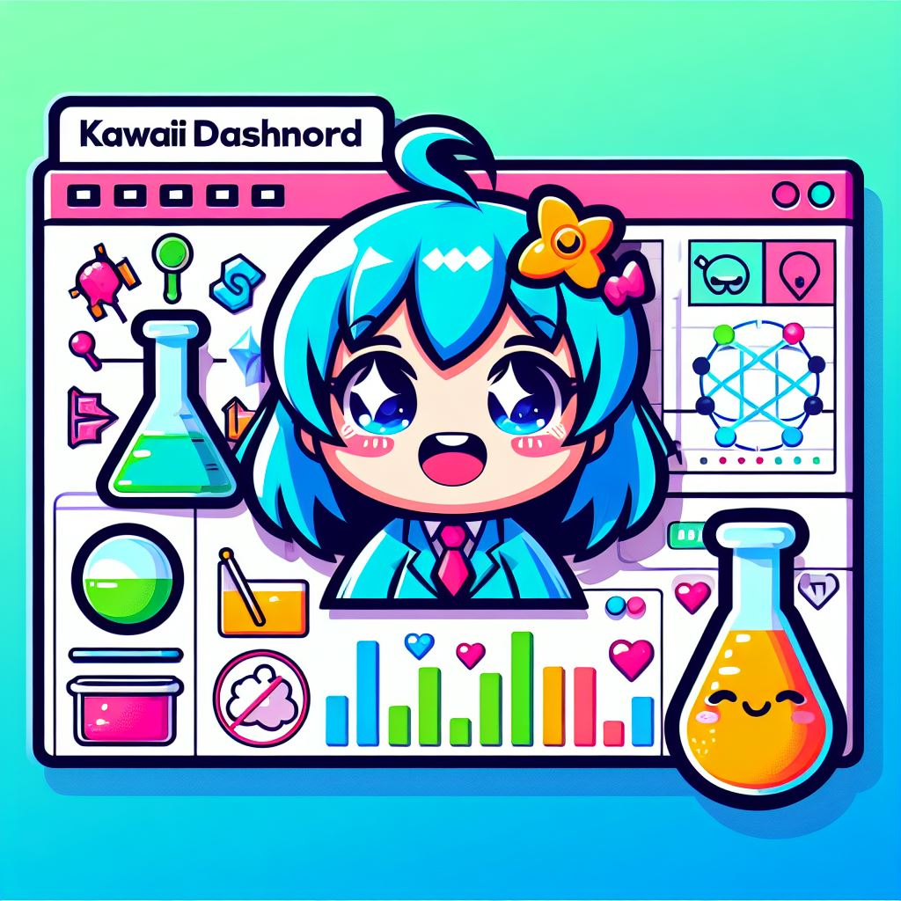

# KawaiiChem Dashboard 🌸💖

## かわいい Chemical Data Visualization Dashboard

Welcome to KawaiiChem Dashboard, where science meets kawaii anime aesthetics! Explore the fascinating world of chemical data in the most adorable way possible. 🌈✨



## Features 💕

- 🎨 Anime-themed background for a kawaii atmosphere.
- 📊 Interactive chemical data visualization.
- 🌟 Pulsating anime elements for added flair.
- 🇯🇵 日本のテーマ性 - Infused with Japanese charm.

## Getting Started 🚀

1. **Clone the repository:**
   ```bash
   git clone https://github.com/FFUV/kawaiichem-dashboard.git
   cd kawaiichem-dashboard
2. Install dependencies:
pip install -r requirements.txt

3. Run the KawaiiChem Dashboard:
python chemical_dashboard.py

Open your browser:
Visit http://localhost:8050/ and immerse yourself in kawaii chemistry!

#Stargazers and Forks 🌟

[](https://github.com/FFUV/kawaiichem-dashboard/stargazers)
[](https://github.com/FFUV/kawaiichem-dashboard/network/members)
[](https://star-history.com/#FFUV/KawaiiChem-Dashboard&Date)
.
#Contributing 🌟

We welcome contributions to make KawaiiChem Dashboard even more kawaii and functional! Feel free to submit issues or pull requests.

#Credits 🌸

Anime.js - https://animejs.com/
Waifu-tips - https://github.com/AzurAPI/waifu-tips
ありがとう 🙏
Thank you for choosing KawaiiChem Dashboard! Spread the kawaii love and happy data exploring! 💖✨


